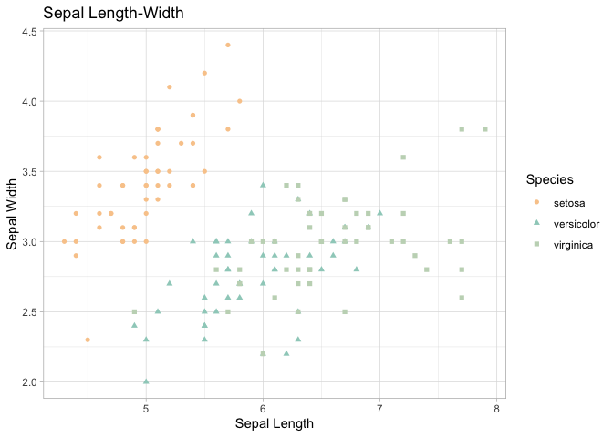

<!-- README.md is generated from README.Rmd. Please edit that file -->

# packageName

<!-- badges: start -->
<!-- badges: end -->

The goal of sunset package is to present a colour scheme/palette for
changing the colours of a ggplot graph.

## Installation

You can install the development version of sunset package with the
following command

``` r
remotes::install_github("https://github.com/etc5523-2021/r-package-takehome-sahinya17.git")
```

## Example

This is a basic example which shows you how to solve a common problem:

``` r
library(sunset)
library(ggplot2)

## basic example code
data("iris")

ggplot(data=iris, aes(x = Sepal.Length, y = Sepal.Width)) +
  geom_point(aes(color=Species, shape=Species)) +
  xlab("Sepal Length") +  ylab("Sepal Width") +
  ggtitle("Sepal Length-Width") +
  scale_color_mountain_d() +
  theme_light()
```


